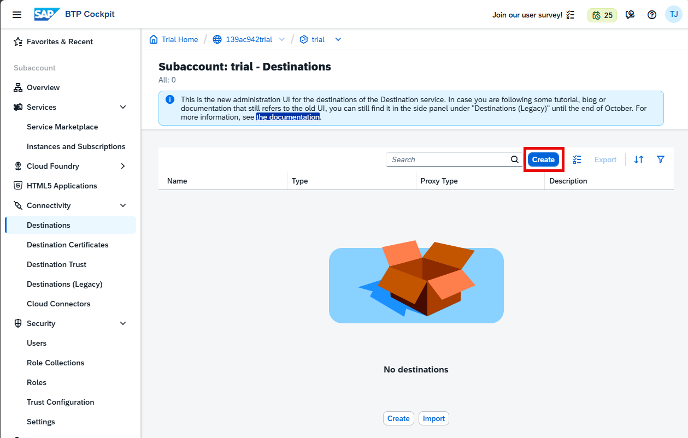
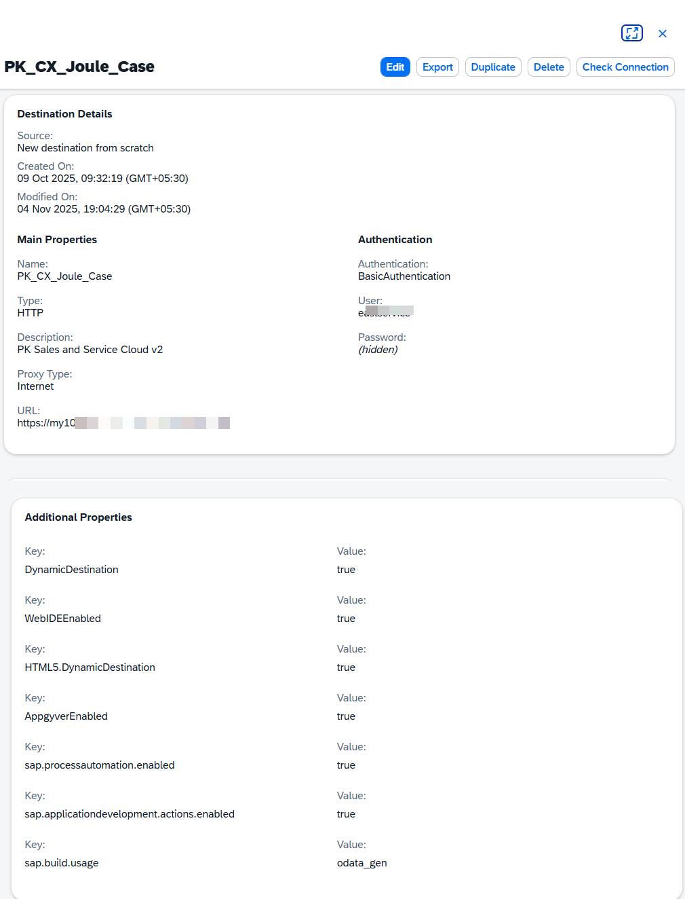

## Create SAP BTP Destination for Service Cloud v2

Before using the SAP Build project, you must configure a destination in your SAP BTP subaccount.

Similar to AI core.please create a destination for Service Cloud V2

1. Go to your SAP BTP subaccount and navigate to **Connectivity → Destinations**, then click **Create Destination**.

2. Click on **Destinations** in the left panel and select **Create Destination** to open the configuration form.

3. When prompted, select **From Scratch**.

### Destination Configuration

## SAP CX Service Cloud V2 Destination Configuration
Please copy all the properties, including the Additional Properties, to the destination configuration accordingly.

| Property    | Value                                                                                |
| ----------- | ------------------------------------------------------------------------------------ |
| Name        | PK_CX_Joule_Case                                                                     |
| Type        | HTTP                                                                                 |
| Description | PK Sales and Service Cloud v2                                                        |
| Proxy Type  | Internet                                                                             |
| URL         | https://myXXXXXXX.de1.demo.crm.cloud.sap |

### Additional Properties

| Property Name              | Value  |
| ------------------------------------------ | --------- |
| DynamicDestination                         | true      |
| WebIDEEnabled                              | true      |
| HTML5.DynamicDestination                   | true      |
| AppgyverEnabled                            | true      |
| sap.processautomation.enabled              | true      |
| sap.applicationdevelopment.actions.enabled | true      |
| sap.build.usage                            | odata_gen |

---

