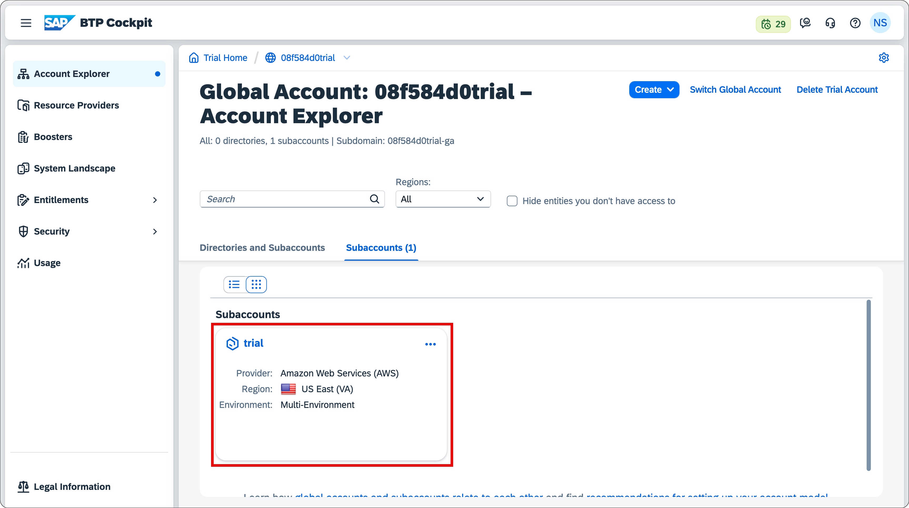
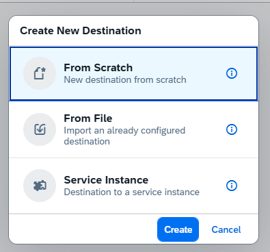

## Create SAP BTP Destination

Before using the SAP Build project, you must configure a destination in your SAP BTP subaccount.

1. Go to your SAP BTP subaccount and navigate to **Connectivity → Destinations**, then click **Create Destination**.

2. Click on **Destinations** in the left panel and select **Create Destination** to open the configuration form.

3. When prompted, select **From Scratch**.

### Destination Configuration

| Field                 | Value                           |
| --------------------- | ------------------------------- |
| **Name**              | `Translation`                   |
| **Description**       | `Translation`                   |
| **Type**              | `HTTP`                          |
| **Proxy Type**        | `Internet`                      |
| **Authentication**    | `OAuthClientCredentials`        |
| **Client ID**         | *Translation Hub Client ID*     |
| **Client Secret**     | *Translation Hub Client Secret* |
| **Token Service URL** | `<URL>/oauth/token`             |
| **URL**               | *Document Translation URL*      |

---

### Additional Properties

| Property Name              | Value  |
| -------------------------- | ------ |
| `DynamicDestination`       | `true` |
| `WebIDEEnabled`            | `true` |
| `HTML5.DynamicDestination` | `true` |
| `AppgyverEnabled`          | `true` |

