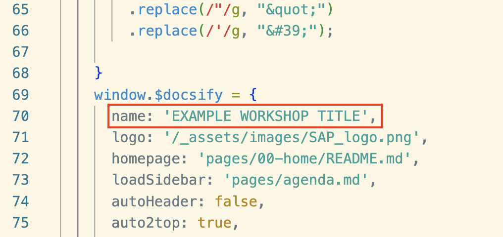
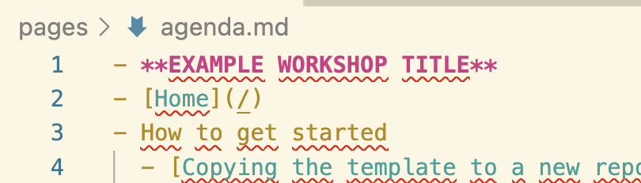

# Set a title for your workshop

> [!INFO]
> You can skip this if you haven't decided on a customer facing name yet.

The title shows up in the browser tabs and the agenda.

1. Open the file `index.html`, and check for the line below (should be around line 22):

    

2. Change the `name` property to the name of your workshop

The title should also show in the sidebar:

3. Open the `agenda-sidebar.md` file. 

    

4. Change the title on the first line

> [!TIP|icon:fa-solid fa-check|label:Congratulations]
> You have set the title of your workshop