## Provision SAP AI Core in Your Global Account

### Prerequisites

* Access to **SAP BTP Cockpit**
* Administrator rights for **Entitlement Management**

---

### Step 1: Access the SAP BTP Cockpit

1. Log in to the **SAP BTP Cockpit**.
2. Navigate to your **Global Account**.

  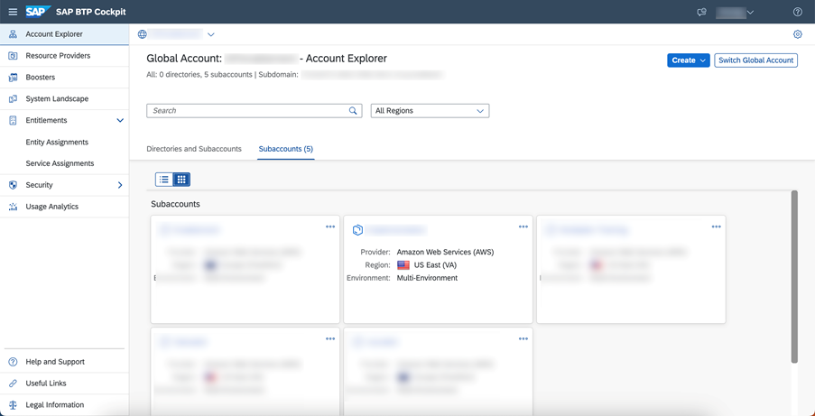
---

### Step 2: Verify Existing Entitlements

1. In the left-hand navigation pane, choose **Entitlements**.

  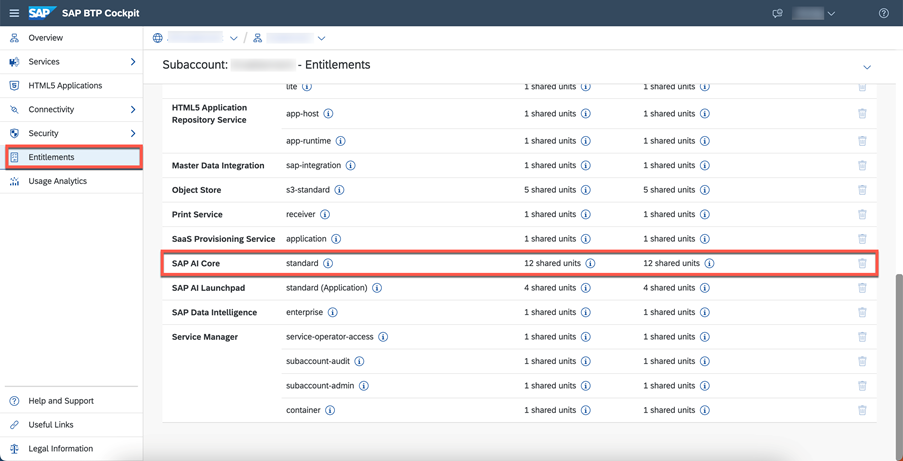

2. Use the search bar to look for **SAP AI Core**.
3. Check whether SAP AI Core is already assigned to your global account.

---

### Step 3: Configure Entitlements

1. Click **Configure Entitlements**.
2. Choose **Add Service Plans**.

  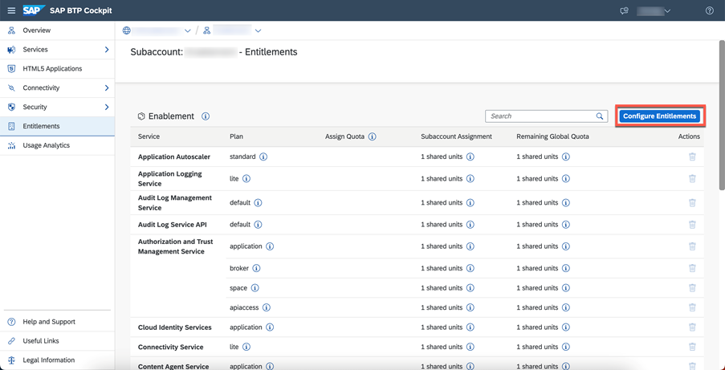

  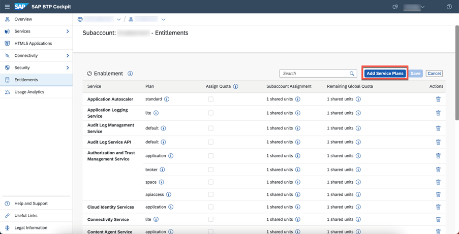
---

### Step 4: Add SAP AI Core Entitlement

1. From the list of available services, select **SAP AI Core**.
2. Choose the **Free** service plan.

  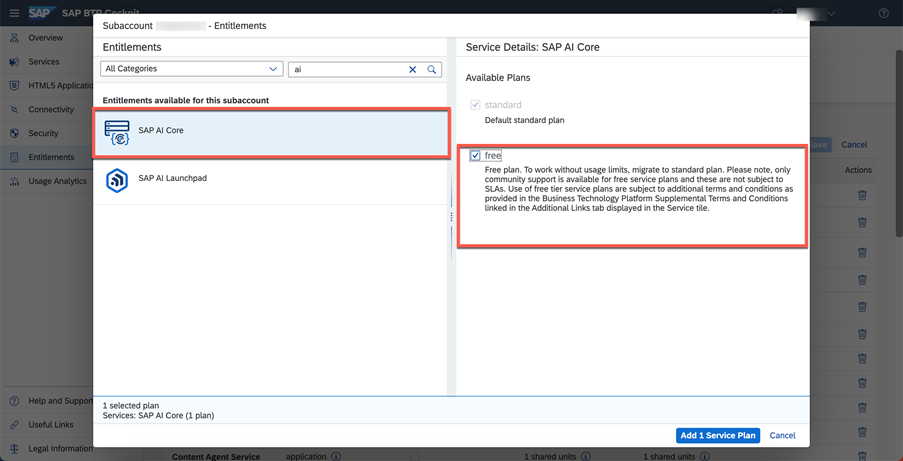

3. Click **Add** to assign the service plan to your global account.

---

### Step 5: Save the Configuration

1. Review the selected service and plan.
2. Click **Save** to confirm and apply the new entitlement.

  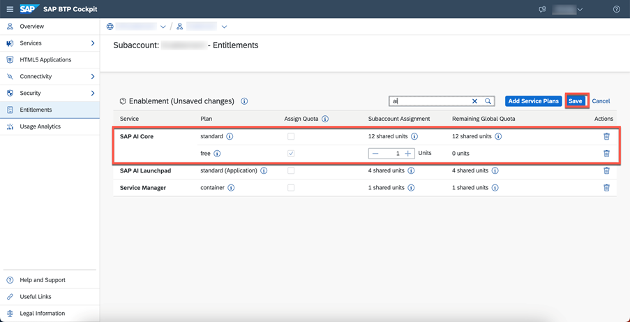

## Run the Booster for SAP AI Core

### Step 1: Open Boosters

1. Log in to the **SAP BTP Cockpit**.
2. From the left-hand navigation pane, choose **Boosters**.

---

### Step 2: Locate the SAP AI Core Booster

1. Browse or search the list of available boosters.
2. Locate and select the **SAP AI Core** booster tile.
3. Review the information displayed on the booster tile, including scope and services to be configured.

  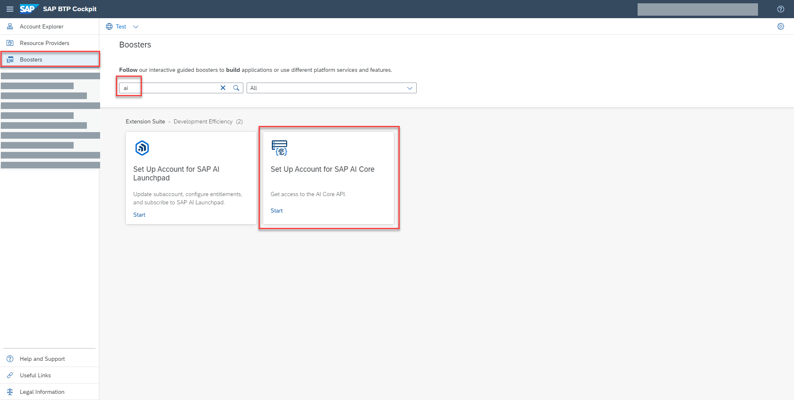

---

### Step 3: Start the Booster

1. Click **Start** on the SAP AI Core booster tile.
2. A setup wizard opens and guides you through the required configuration steps.
3. Follow the on-screen instructions to complete the booster execution.

  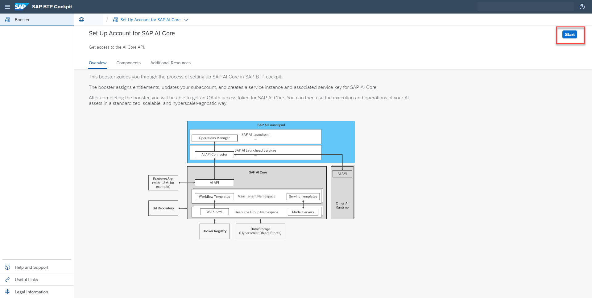

---

## View Your Instances and Create Service Keys

### Step 1: Open Instances and Subscriptions

1. From the left-hand navigation menu, choose **Services** → **Instances and Subscriptions**.

  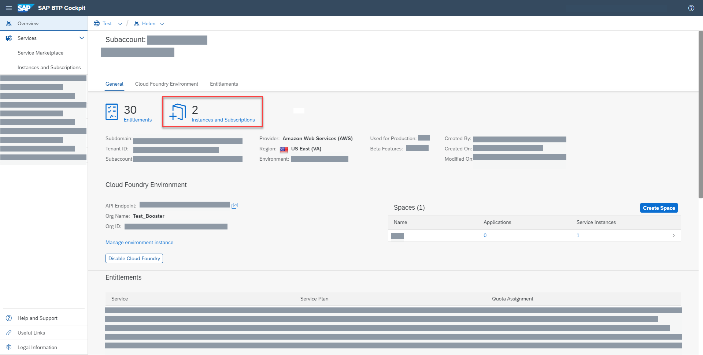
---

### Step 2: View Instance Details

1. Locate your SAP AI Core instance in the list.
2. Click the **chevron** on the instance entry to view detailed information.

---

### Step 3: Create a Service Key

1. Click the **three dots** next to your instance entry.
2. Select **Create Service Key** from the dropdown menu.

  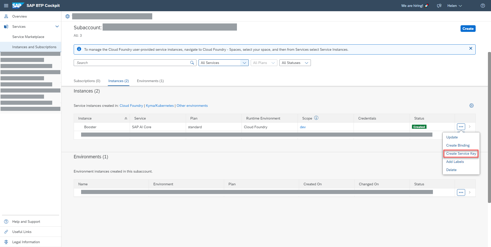

3. Enter a **Key Name** of your choice.
4. Click **Create** to generate the service key.

  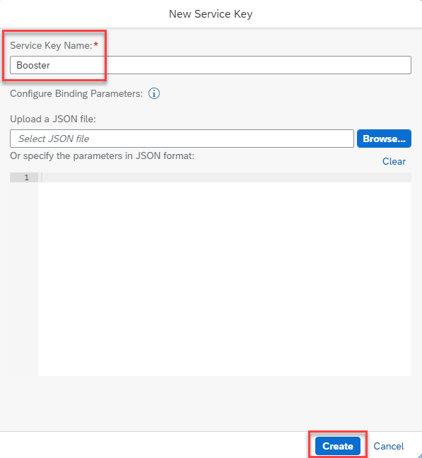

  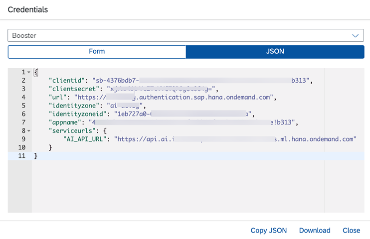
---

### Step 4: View or Download Service Keys

1. After creation, your service keys are listed under the instance.
2. To view or download a key, click the **three dots** next to the key entry.
3. Choose the desired action (**View**, **Download**, or **Delete**) from the available options.

  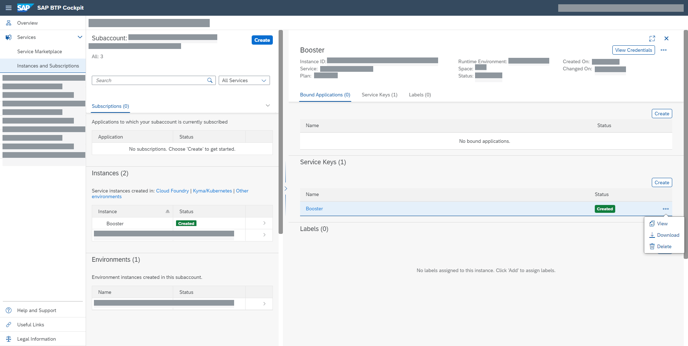

---

