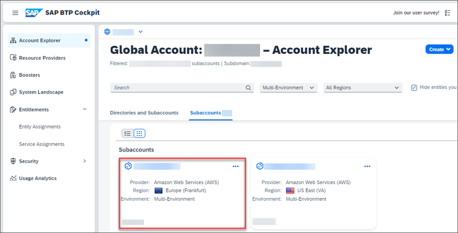
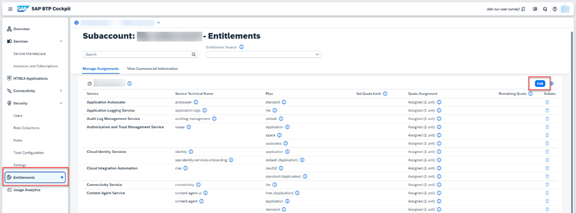
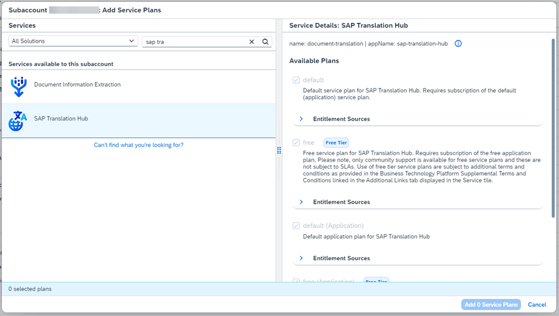
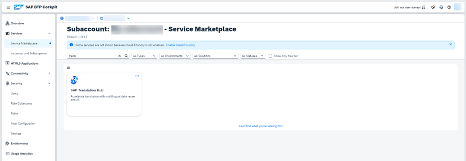
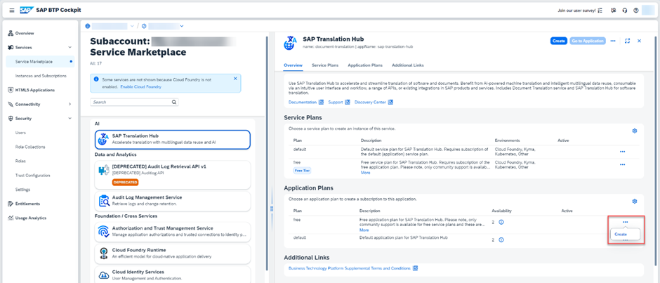
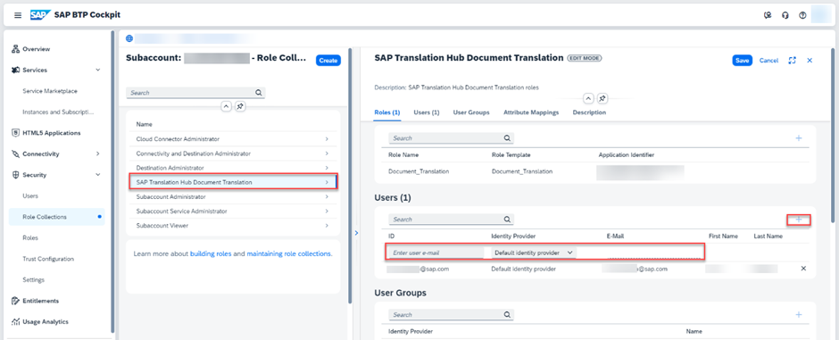
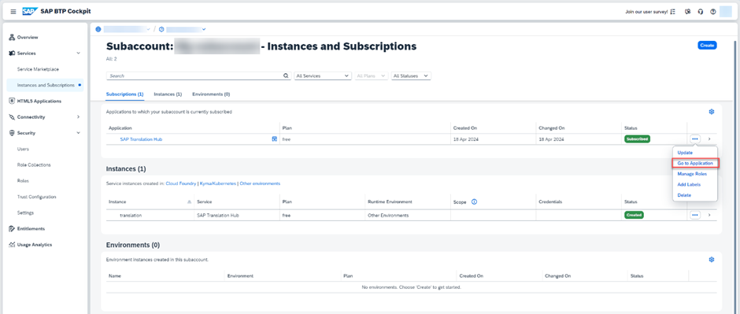
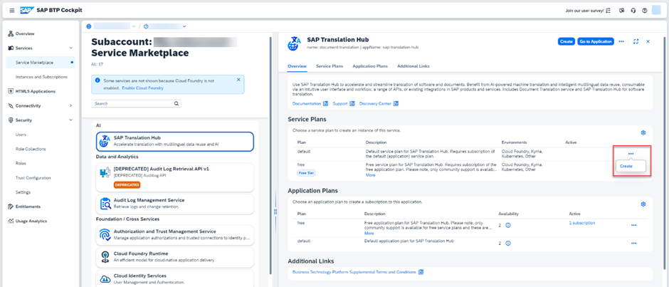
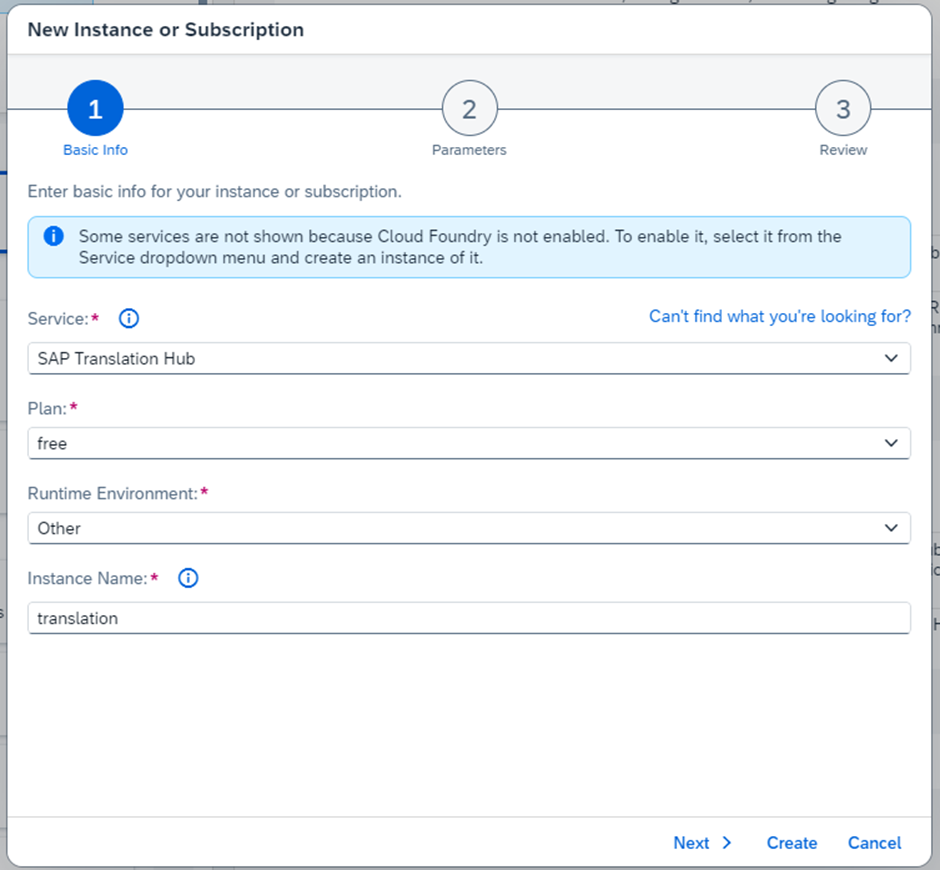
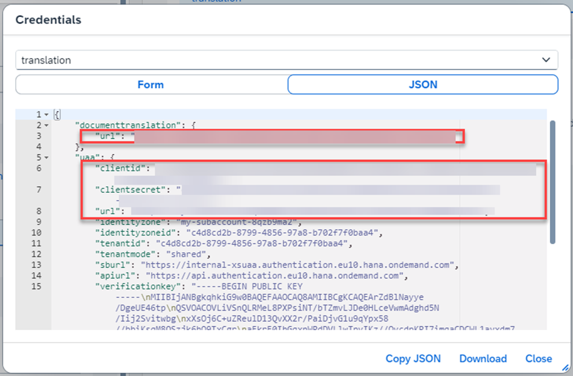

# Access and Configure SAP Translation Hub on SAP BTP

## 1. Open SAP BTP Cockpit and Select Subaccount

1. Open your web browser and log in to the **SAP Business Technology Platform (BTP) Cockpit**.
2. Select your **Global Account**.
3. From the global account page, click the tile of the **subaccount** you created (as shown in the example screenshot).

## 2. Verify or Create Subaccount in Supported AWS Region

Ensure that your subaccount is created in one of the following **AWS regions**:

* **Europe (Frankfurt)** – `cf-eu10`
* **US East (Virginia)** – `cf-us10`

### If you do not have a subaccount in one of these regions:

1. Click **Create → Subaccount** (top-right corner).
2. Choose either:

   * `cf-eu10` or
   * `cf-us10` as the region.
3. Complete the subaccount creation process.

## 3. Assign Entitlements for SAP Translation Hub

1. In your subaccount, navigate to **Entitlements**.
2. Click **Edit**.
3. Select **Add Service Plans**.
4. Search for **SAP Translation Hub**.
5. Select the required service plan:

### Recommended: Free Plan (for testing)

* **500,000 characters** for Document Translation
* **100,000 characters** for Software Translation

> **Recommendation**
> Enable both **Instance** and **Subscription** plans together.
>
> * The **Subscription** provides UI access
> * The **Instance** provides API credentials

6. Click **Add Service Plans**.
7. Click **Save**.

---

## 4. Access SAP Translation Hub via Service Marketplace

1. In the subaccount navigation sidebar, click **Service Marketplace**.
2. Search for **SAP Translation Hub**.
3. Click the **SAP Translation Hub** tile.

---

## 5. Create a Subscription (UI Access)

To use SAP Translation Hub via the **user interface**:

1. Under **Service Plans**, select **Free** or **Default**.
2. Click **Create**.

3. Confirm by clicking **Create** again.
4. Click **View Subscription** to see it under **Instances and Subscriptions**.

---

## 6. Assign User Authorization

Before using the application, users must be authorized.

1. Navigate to **Security → Role Collections**.
2. Select **SAP Translation Hub Document Translation**.
3. Click **Edit**.
4. Add users by entering their **email addresses** under **Users**:

   * Use the **Default Identity Provider**
   * Use the **+ icon** to add multiple users
5. Click **Save**.

---

## 7. Launch the Application

1. Navigate to **Instances and Subscriptions**.
2. Open the application using the shortcut or menu.
3. SAP Translation Hub opens in a **new browser tab**.
4. Share the **application URL** with authorized users.
5. Use the **dropdown menu** to switch between available translation functions.

---

## 8. Create a Service Instance (API Access)

If API credentials are required for integrations:

1. Open **Service Marketplace**.
2. Select **SAP Translation Hub**.
3. Under **Service Plans**, choose **Free** or **Default**.
4. Click **Create Instance**.
5. Enter a meaningful name (example: `translation`).
6. Leave other parameters as default.
7. Click **Create Instance**.
8. Click **View Instance** or navigate to **Instances and Subscriptions**.

---

## 9. Create a Service Binding

Service bindings generate credentials required for applications to access the service.

1. Go to **Instances and Subscriptions**.
2. Click the **three dots (⋮)** next to your service instance.

3. Select **Create Service Binding**.
4. Enter a binding name (example: `demo-binding`).
5. Click **Create**.

### You can now:

* View the **service binding credentials** in the browser, or
* Download them for **application integration**

---

## 10. Next Steps

* Use the UI for **manual document translation**
* Use service binding credentials for **API-based integrations**
* Integrate with **SAP Build Apps**, **Node.js**, or **CAP applications**

