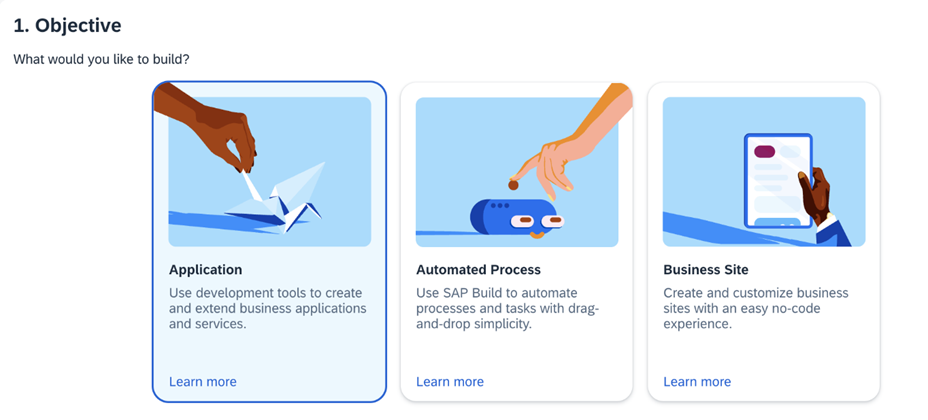
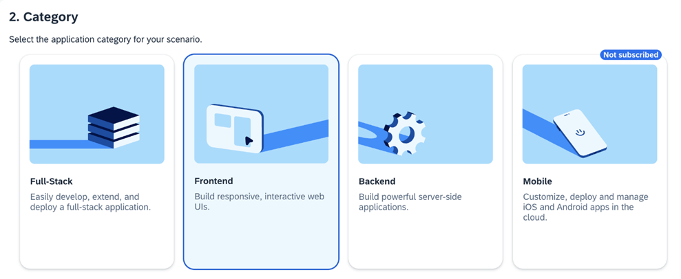
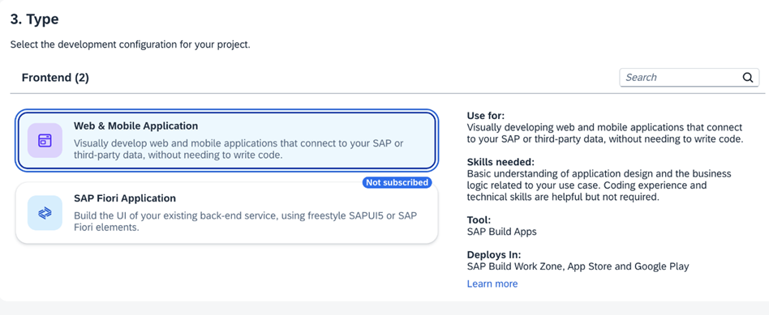
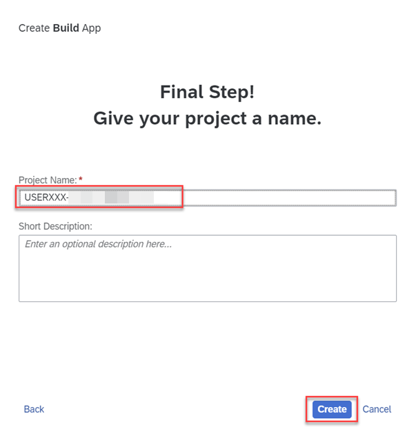
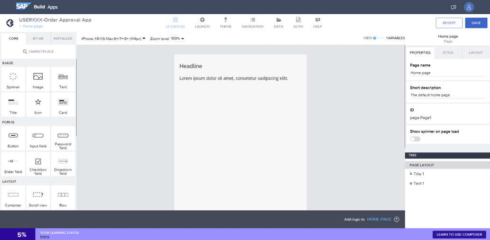

# Open SAP Build Apps Application

Under **Instances and Subscriptions**, locate your **SAP Build Apps** subscription and click to open the application.

# Creating a Project

1. Open the **Build Lobby** URL in your browser. Login with your user and password. Click on **Create** button to create a new Build Project.  

   

2. Click **Build an Application** card.  
   

3. Click **Frontend** card.  
   

4. Click **Web & Mobile Application** card.  
   

5. Enter Project name as **USER0${number}-Translation-Hub**. Click **Create**.  
   

6. You should see the **Build Apps landing screen**.  
   