# Designing the App

1. Let's start with a clean canvas. Click on the element shown in the page and then click on the **x** icon to delete this element.  
   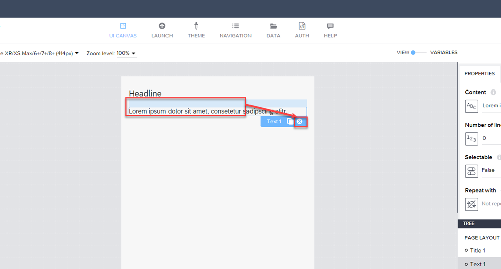

2. Drag the container.  
   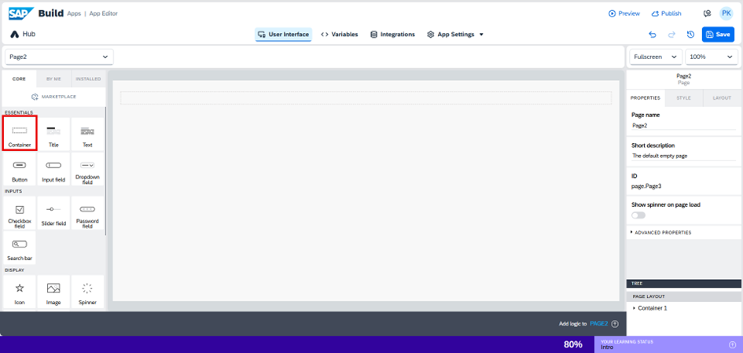

3. Drag the image into the container and set its width to **80px**.  
   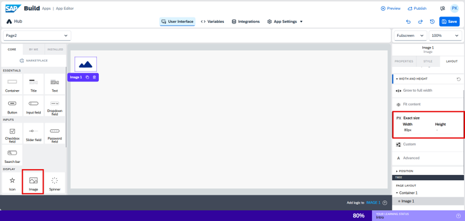

4. Place the container and text field inside the same parent container, and set the text to **Document Translation**.  
   

5. Set the text name to **Document Translation**.  
   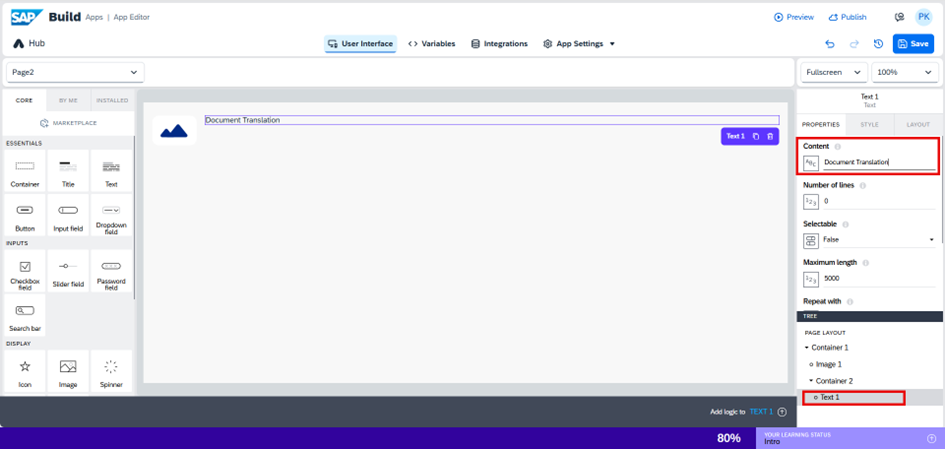

6. Go to the **Layout** tab and set the text alignment to **Center**.  
   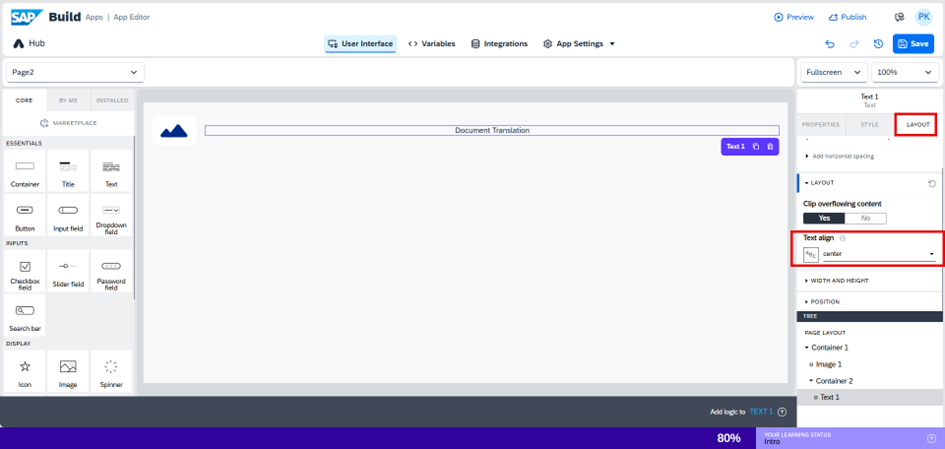

7. Click on the image inside the container to upload a picture from your local folder and set it as the image.  
   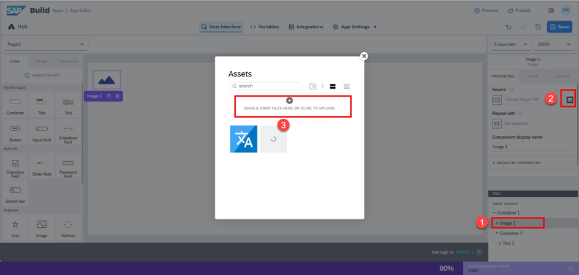

8. Click on the parent container, then select **Edit Styles** for the container.  
   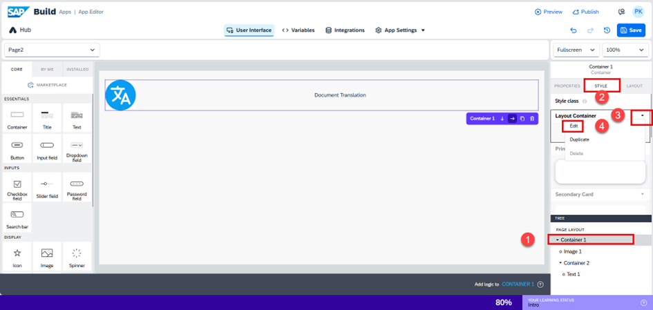

9. Click on **New Palette**, enter the color code `#099DF1`, and then click **Save**.  
   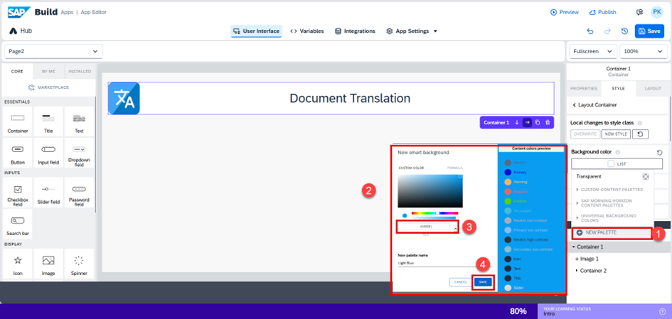

10. On click, set the text size to **fontHeaderSize2**.  
    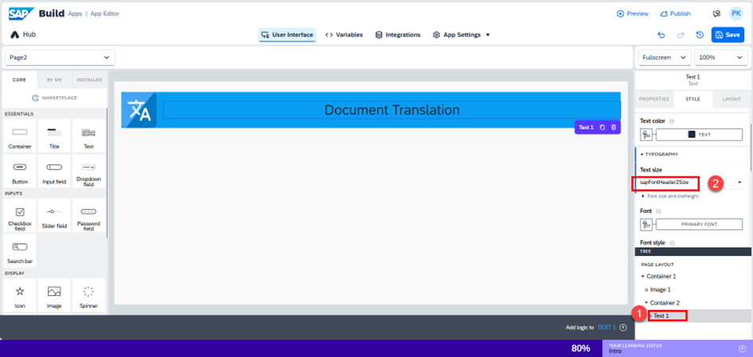

11. Click on **APP variables as strings**.  
    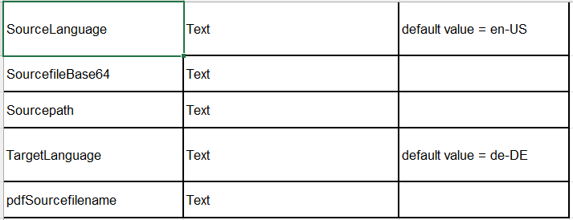  
    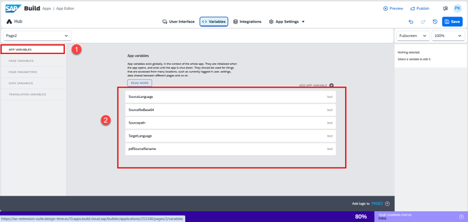

12. Go to the **Integrations** tab and click **Add Integration**.  
    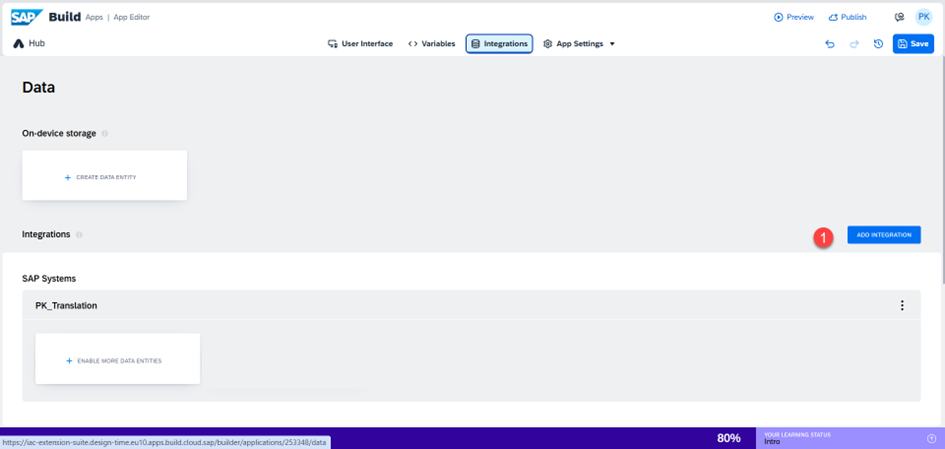

13. Click on **BTP destinations**.  
    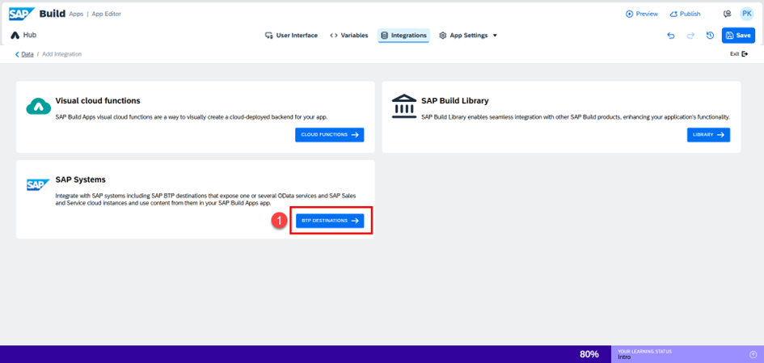

14. Click **Install Integration** as a **REST API**.  
    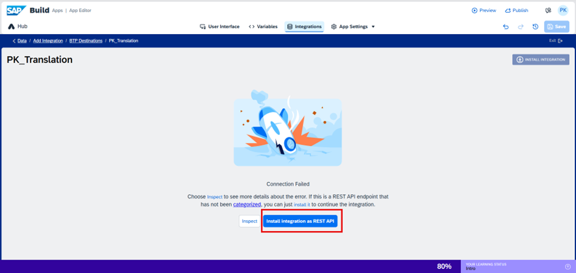

15. Uncheck the checkbox (remove any selection), and set the name as **Language**.  
    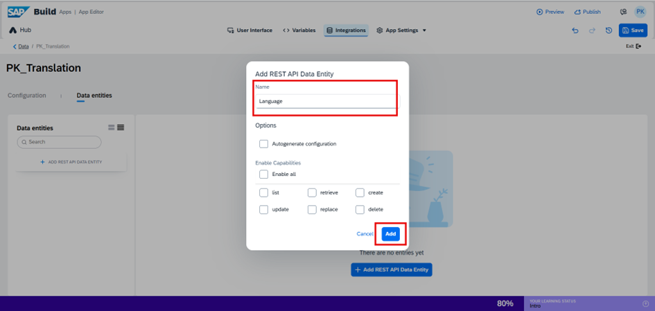

16. Set the following:  
    - Relative path and query: `/api/v1/languages`  
    - Response mapper: `{records: response.data.languages, driverCode: response.status}`  
    - Run the test  
    - Auto-detect fields from response  
    - Save  
    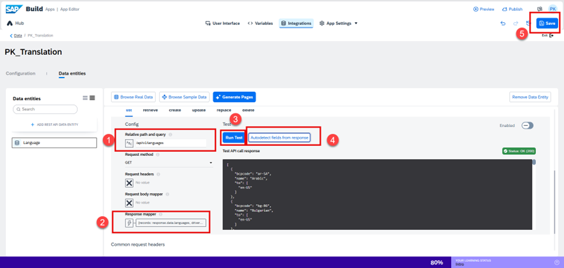

17. Go to the **Variables** tab → select **Data Variables** → click **+** → add **Languages** as a **Collection** → then Save.  
    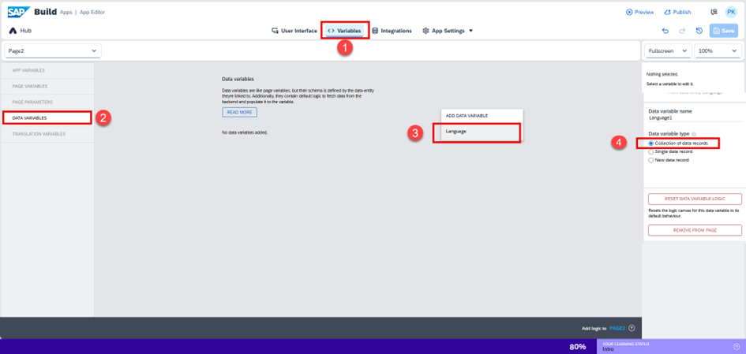