# Designing the App

1. Let's start with a clean canvas. Click on the element shown in the page and then click on the **bin** icon to delete this element.  
 
 

2. Delete the other line item click on the **bin** icon to delete this element. 

3. Drag the container.  

 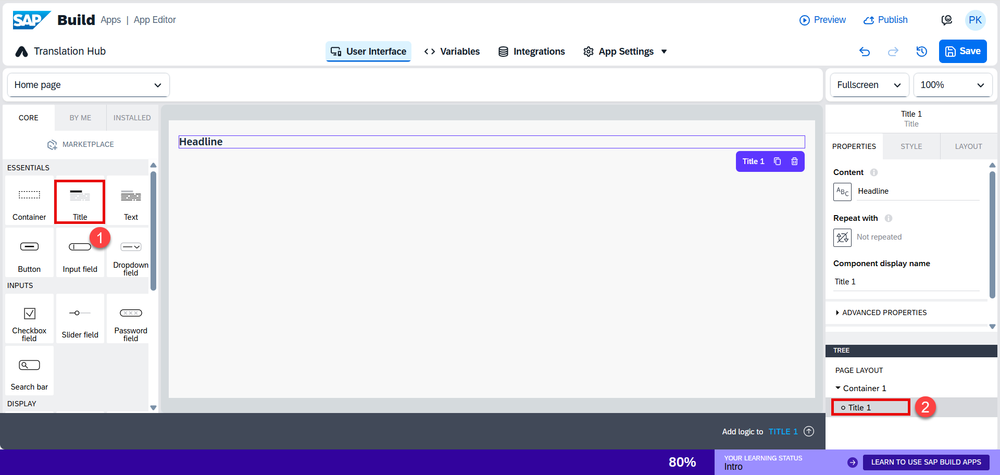

4. Add an Container

* Drag the **Container** component into the white space area.
* Select the **Style** option.
* Choose **Primary Card** as the style.

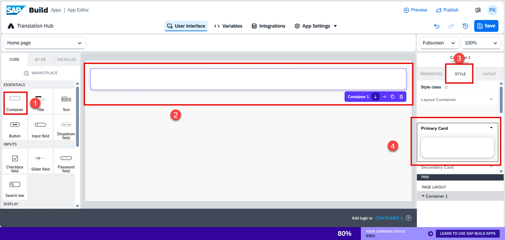

5. Add a Title to the Container

* Drag the **Title** component into the same container.
* Select the **Style** option.
* Choose **Page Secondary Heading – Primary Card**.

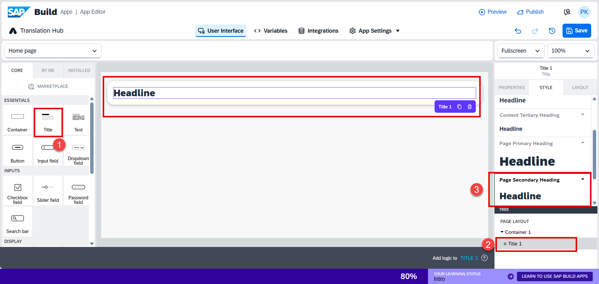

6. Select **Title** → **Layout** → set **Text Alignment** to **Center**.

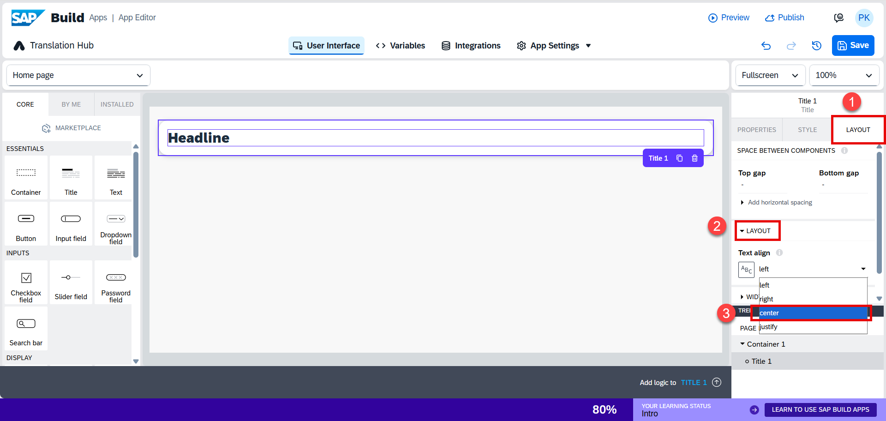
7. Select **Title** → **Properties** → update the **Content** field to **Language**.

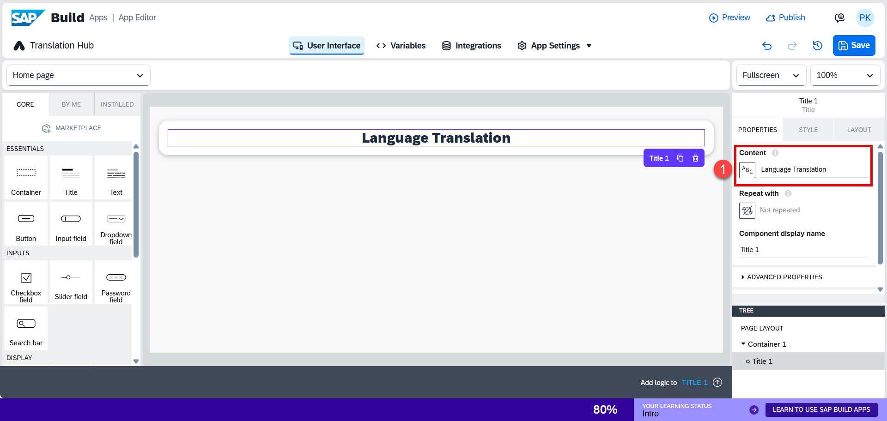

8. Select **Container** → **Style** → click **Edit** under **Primary Card**.

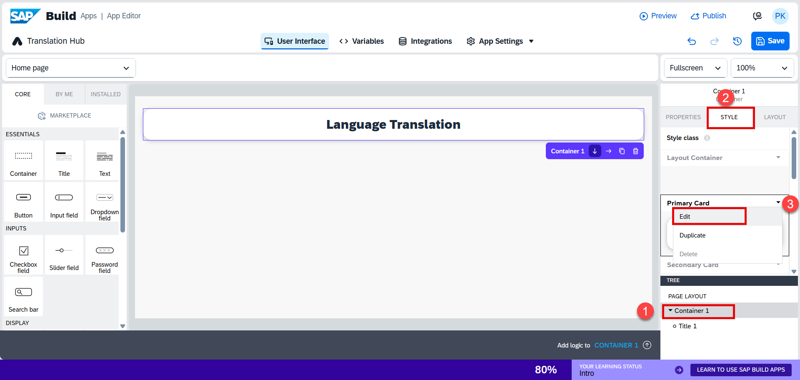

9. Set the **Background Color** to **Emphasized**.

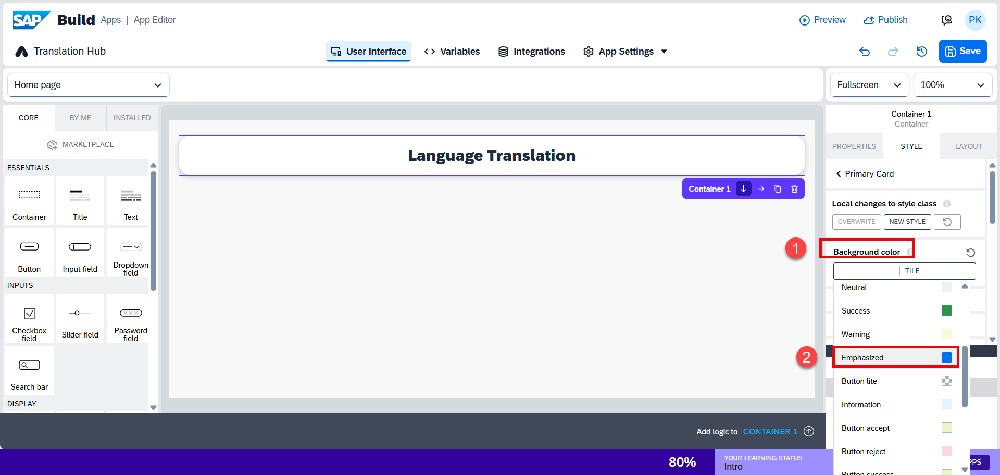

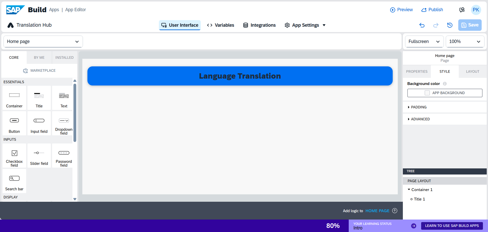

10. Go to **Variables** → **App Variables** → click **+** → select **From Scratch**.  

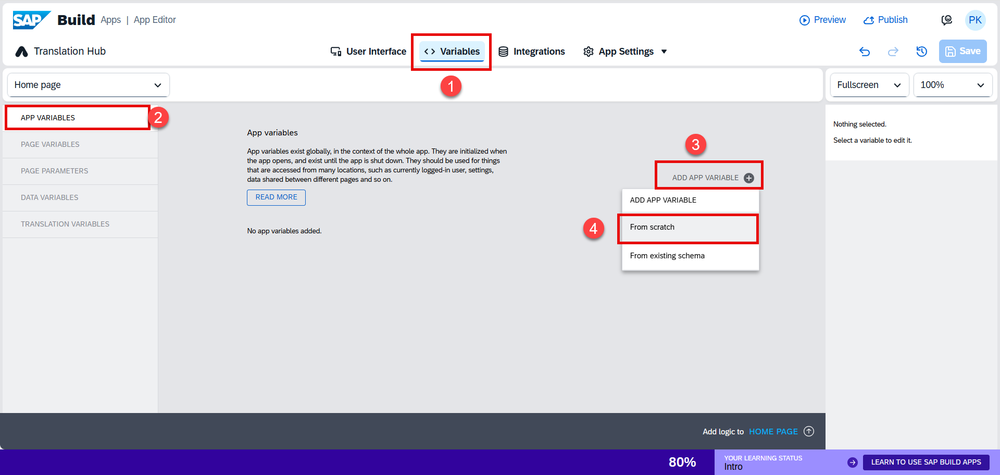

11. Enter the variable name as `SourceLanguage` and set the initial value to `en-US`.

Similarly repeat the same steps for the remaining fields.
    
   | Field              | Type | Initial Value |
   |--------------------|------|---------------|
   | SourceLanguage     | Text | `en-US`       |
   | SourcefileBase64   | Text | —             |
   | Sourcepath         | Text | —             |
   | TargetLanguage     | Text | `de-DE`       |
   | pdfSourcefilename  | Text | —             |

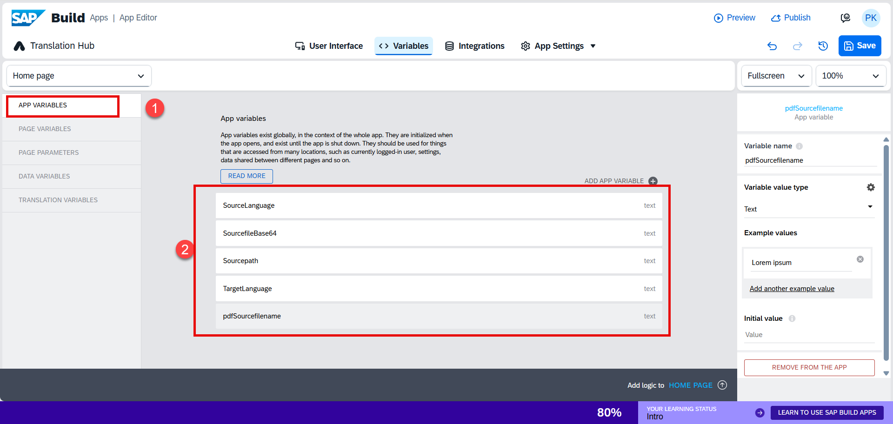

10. Go to the **Integrations** tab and click **Add Integration**.  

   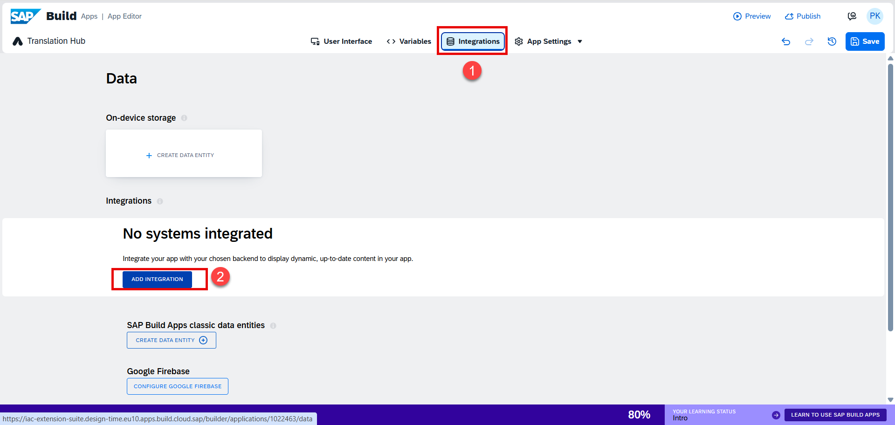

11. Click on **BTP destinations**.  
    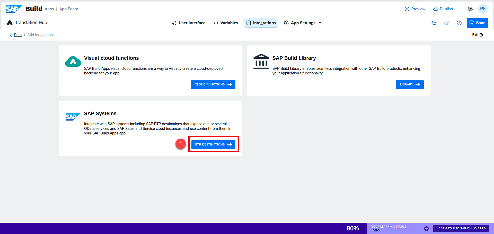

12. Select your **BTP destinations**.  
   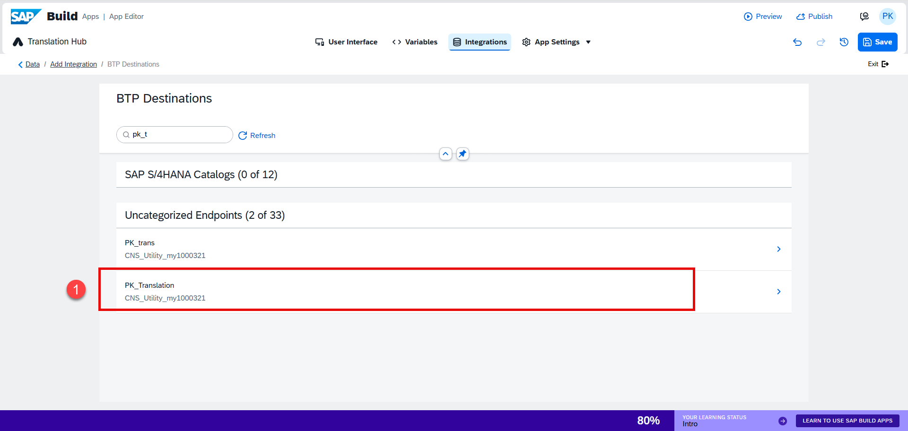

15. Click **Install Integration** as a **REST API**.  
   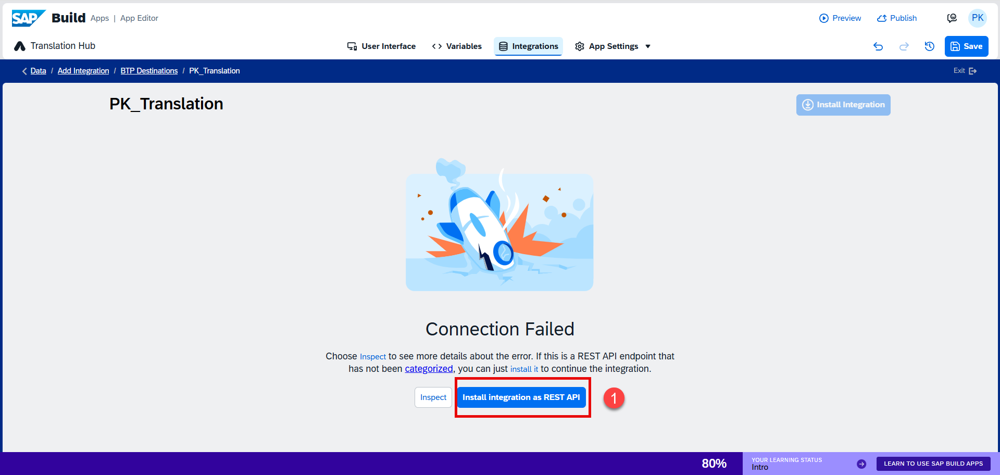

16. Uncheck the checkbox (remove any selection), and set the name as **Language**.  
   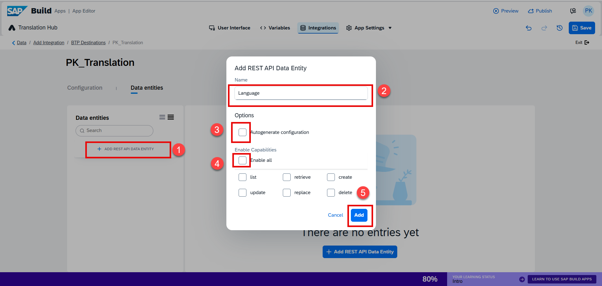

17. Set the following:  
    - Relative path and query: `/api/v1/languages`  
    - Response mapper: `{records: response.data.languages, driverCode: response.status}`  
    - Run the test  
    - Auto-detect fields from response  
    - Save  
    
    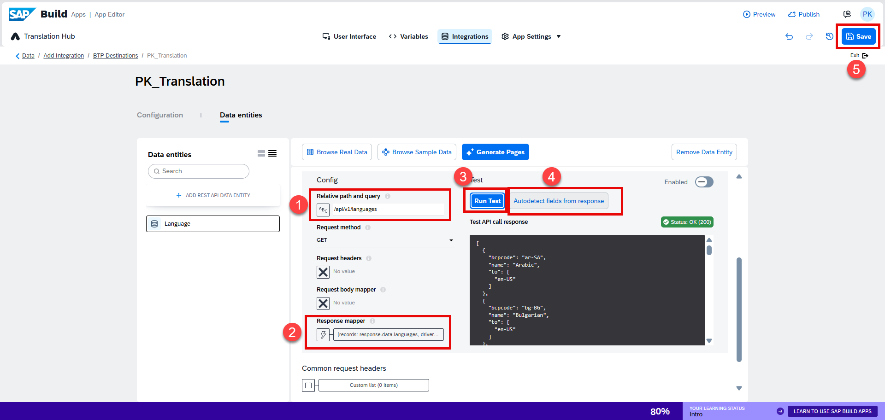

18. Go to the **Variables** tab → select **Data Variables** → click **+** → add **Languages** as a **Collection** → then Save.  
      
