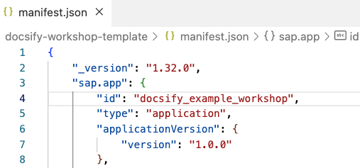
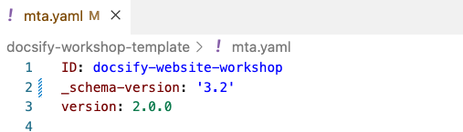
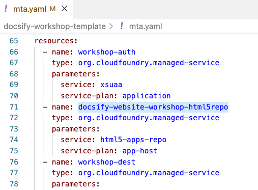

# Other files

There are some things to do before deploying the exercises in the workshop-tools subaccount:

### `manifest.json`

This file contains configuration for the HTML5 Application Repository and Workzone. Each app needs to have a unique id (line 4):

### `mta.yaml`

This file contains the configuration to deploy the project n SAP BTP Cloud Foundry. The project needs some unique names for:

- The project ID (line 1):

    

- The HTML5 app repo host service (line 71):

    

    > [!NOTE]
    > The name appears several times in the file, so better do a search and replace when changing it