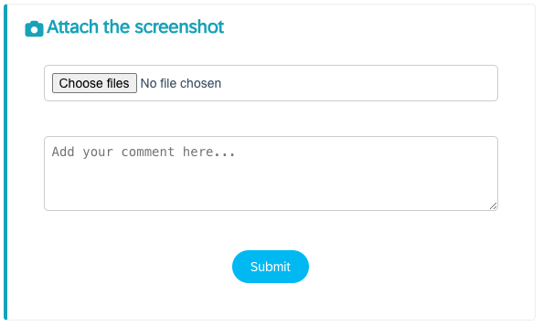
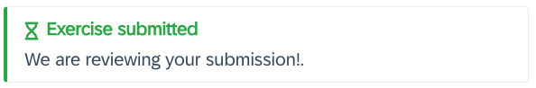
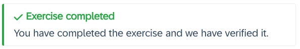
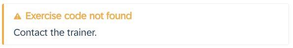

# Dynamic content

Many times you want to provide tailored instructions including the number assigned to the participant, a username or password.

You can include dynamic content in your exercises that will be replaced when the participant opens the exercises.

## Number

Use the placeholder `${number}`. This will be replaced by a number (e.g.: 02, 10, 23) when the participant access the exercises.

## Users and passwords

Depending on the credentials and the system (check with Pedro), you can use the placeholders `${ias.user}` and `${ias.password}`,  `${vm.user}` and `${vm.password}`,...

## Exercise forms

When defining [exercises](pages/15-exercises-approval/README.md) for a workshop, you can include the placeholder `${exercise:exercise-code}`, this will be replaced by:

- A form if the participant has not submitted anything

    

- A message indicating that the trainers are verifying a submission

    
    
- A message if the exercise if verified and approved

    

- A message if the exercise code is not found

    