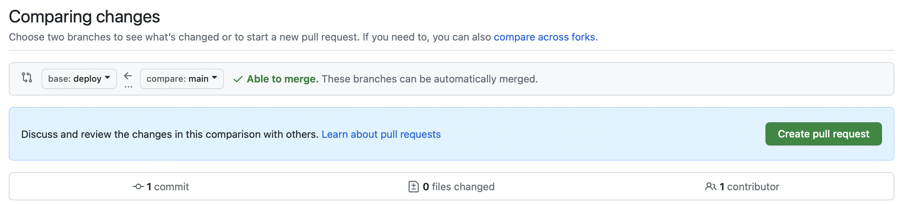

# Auto deployment

> [!ATTENTION]
> Ask Pedro to deploy the exercise and set up auto-deployment the first time.

After that you will be able to update and deploy the exercise by yourself. This is done using the concepts of [branches](https://docs.github.com/en/pull-requests/collaborating-with-pull-requests/proposing-changes-to-your-work-with-pull-requests/about-branches) and [pull requests](https://docs.github.com/en/pull-requests/collaborating-with-pull-requests/proposing-changes-to-your-work-with-pull-requests/about-pull-requests) of git and GitHub, and setting up an automatic job in a [Jenkins](https://jenkins.c-8bbd345.kyma.ondemand.com/) instance.

The flow to update the exercise is the following:

1. Make the changes you need in the `main` branch (or any other branch except the `deploy` branch)

2. Create a pull request to bring the changes your branch to `deploy`:

    1. Go to _Pull requests_
    2. Click on _New pull request_
    3. Set the direction: `deploy`<- `main`. Click _Create pull request_
        

        > [!WARNING]
        > Make sure the order is right!
        > `deploy`<- `your-branch`
    4. Add a title (if empty) and click _Create pull request_
    5. Click _Merge pull request_
    6. Click _Confirm merge_

> [!NOTE]
> `deploy` branches are protected, which mean that only the workshop owners can accept pull requests.

The deployment process will start.

The time it takes to deploy depends on the amount of content (pages, images), usually is between 1 and 2 minutes. For very heavy workshops it can take up to 10 minutes.

You can check the deployment progress in our [Jenkins instance](https://jenkins.c-8bbd345.kyma.ondemand.com).

> [!TIP]
> After deployment, delete the cache of your browser if you can't see the updates
