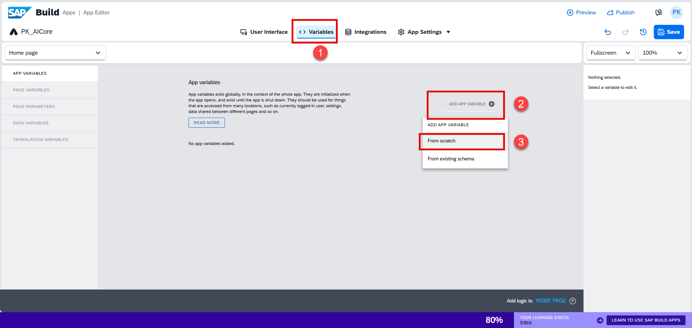
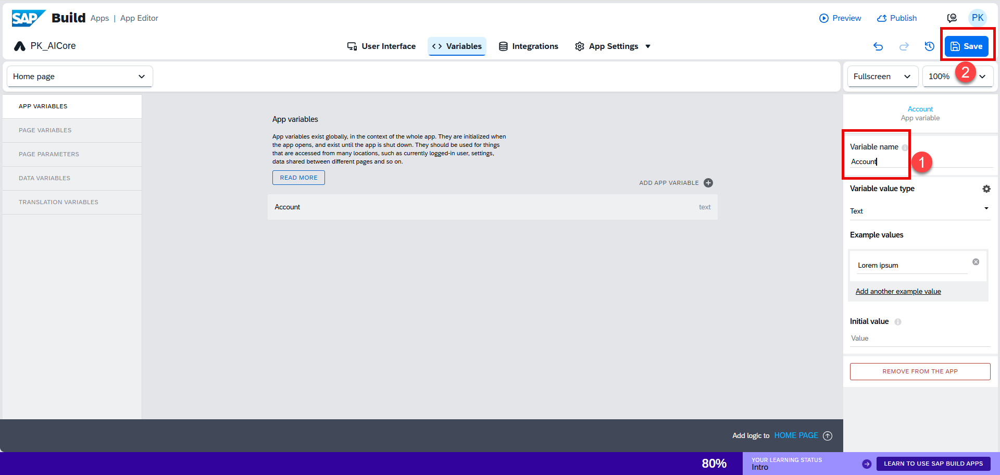
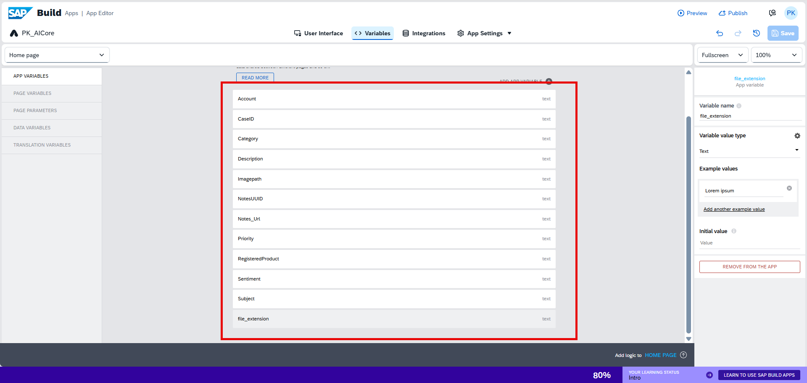

# Creating varibles

1. Navigate to the **Variables** tab. Click **Add App Variable → From Scratch**.

   

2. Enter the variable name as `Account`, then click **Save**.

   

3. Repeat the above steps for the remaining variables as listed in the table below.

   

    | Variable Name     | Type |
    | ----------------- | ---- |
    | CaseID            | Text |
    | Category          | Text |
    | Description       | Text |
    | Imagepath         | Text |
    | NotesUUID         | Text |
    | Notes_Url         | Text |
    | Priority          | Text |
    | RegisteredProduct | Text |
    | Sentiment         | Text |
    | Subject           | Text |
    | file_extension    | Text |

