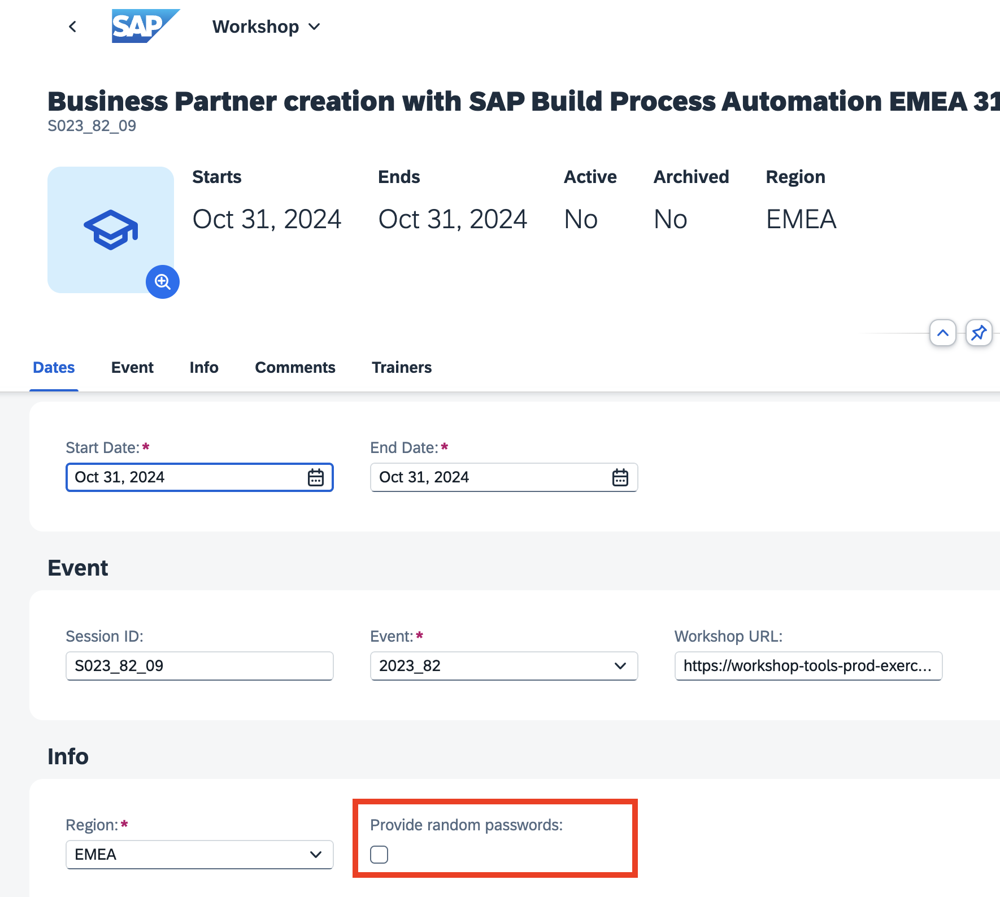

# Random passwords

When giving access to our systems, it is important we control who has access, and to limit the access only to a period of time. Using a random password, unique for each user and for each workshop gives you complete control of when you want to cut off access to the exercises.

Different passwords for each participants also allows more personalized content (new features coming), as there is no risk that a user will login to another's exercises page.

When scheduling a workshop, you can choose to use random credentials using the checkbox:

When this is **checked** and you _Activate_ the workshop, _workshop-tools_ will fetch the default credentials, and, for each of them it will:

- Generate a random password formed by two words and two digits: _elegant-rat55_, _quirky-boat89_,...
- Using the SCIM API, set the random password for that user in IAS
- Add this user and password in the active _Credentials_ table

When you are done with the workshop and want to cut off access to it, you can _Close_ the workshop. Then, for each user, it will:

- Set back the default password in IAS (Welcome1!, W3lcome123,...)
- Delete the credentials from the active _Credentials_ table

> [!NOTE]
> When activating/closing a workshop with random passwords, passwords can take longer to appear.
>
> Do not worry, just let the system process the passwords for a few more minutes and come back later, you should find the workshop activated/closed.
