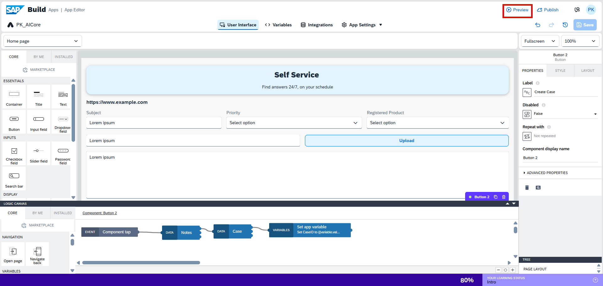
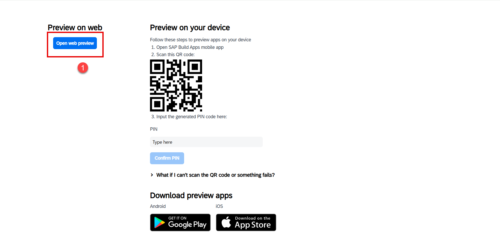
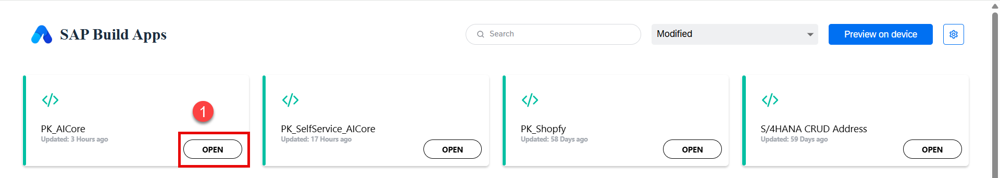
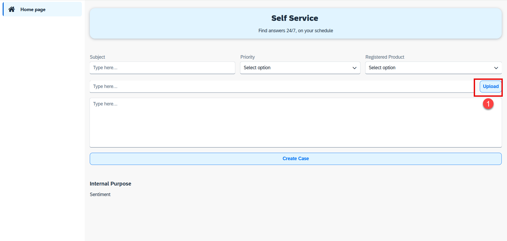
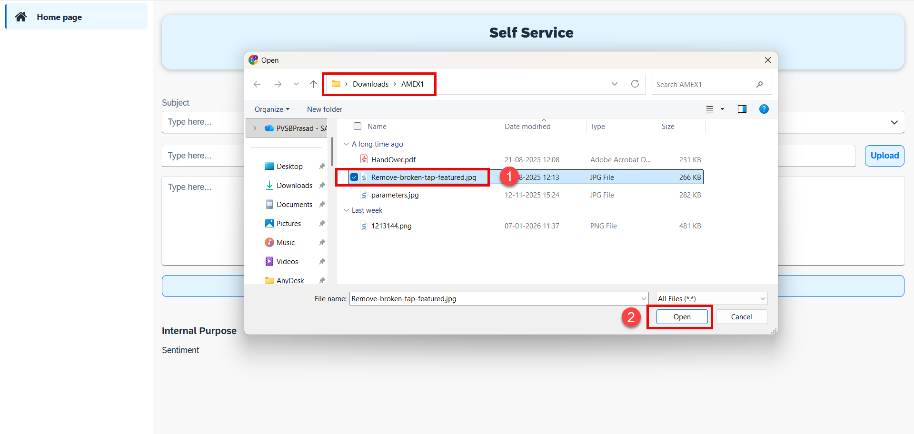
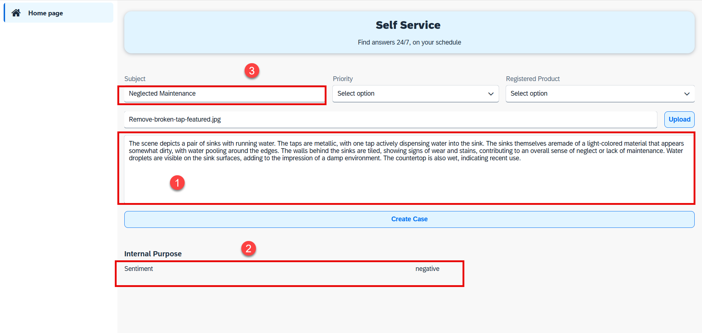
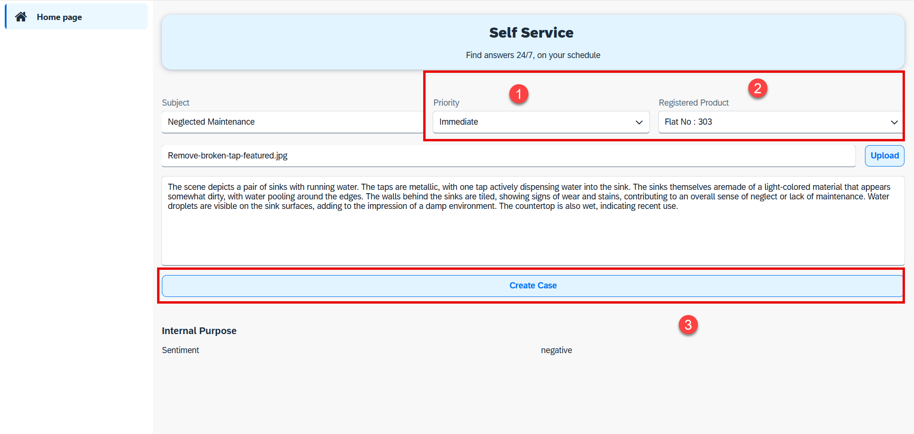
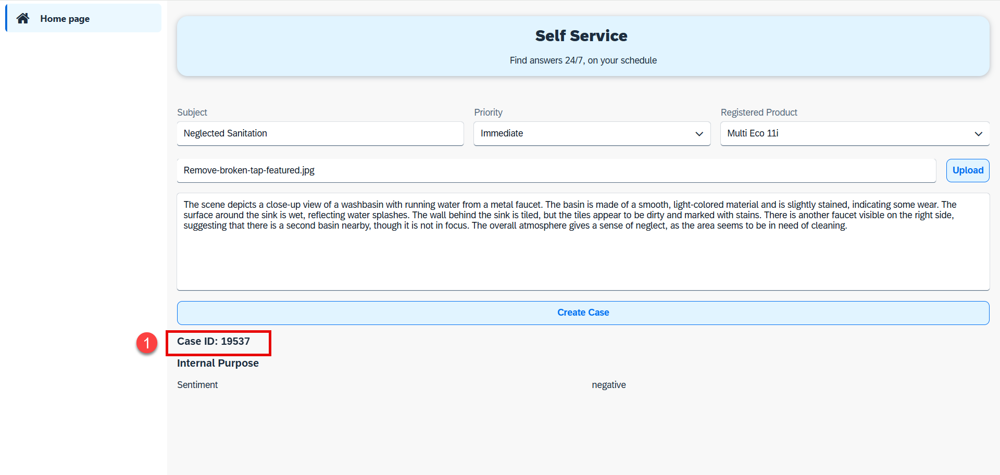
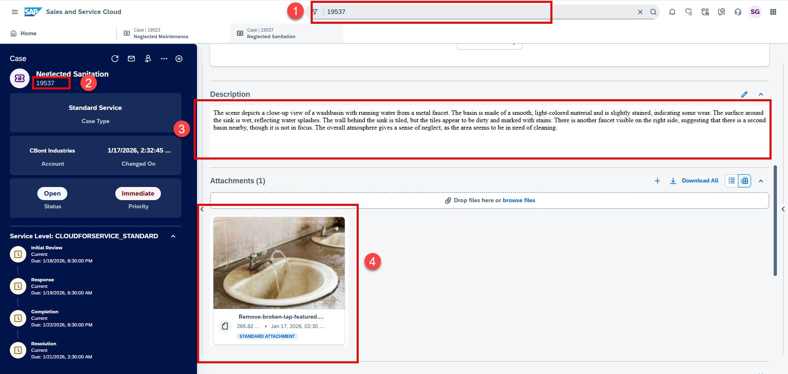

## Preview SAP Build Apps Application

1. Click the **Preview** icon at the top of the application.
   

2. Click **Open Web Preview**.
   

3. Click **Open** to launch the application preview.
   

4. Click the **Upload** button.
   

5. Select an image from your local desktop.
   

6. Observe that the **Subject**, **Sentiment**, and **Description** fields are automatically populated.
   

7. Select the **Priority** and **Registered Product**.>It is manadtory to select in this **registered product**
   

8. Click on **Create Case**.
   

9. A case is successfully created with the **note** and **attachment**.
   

---

