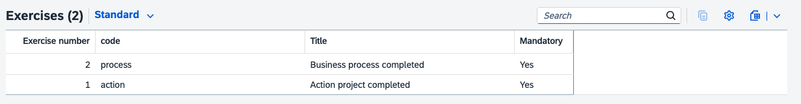
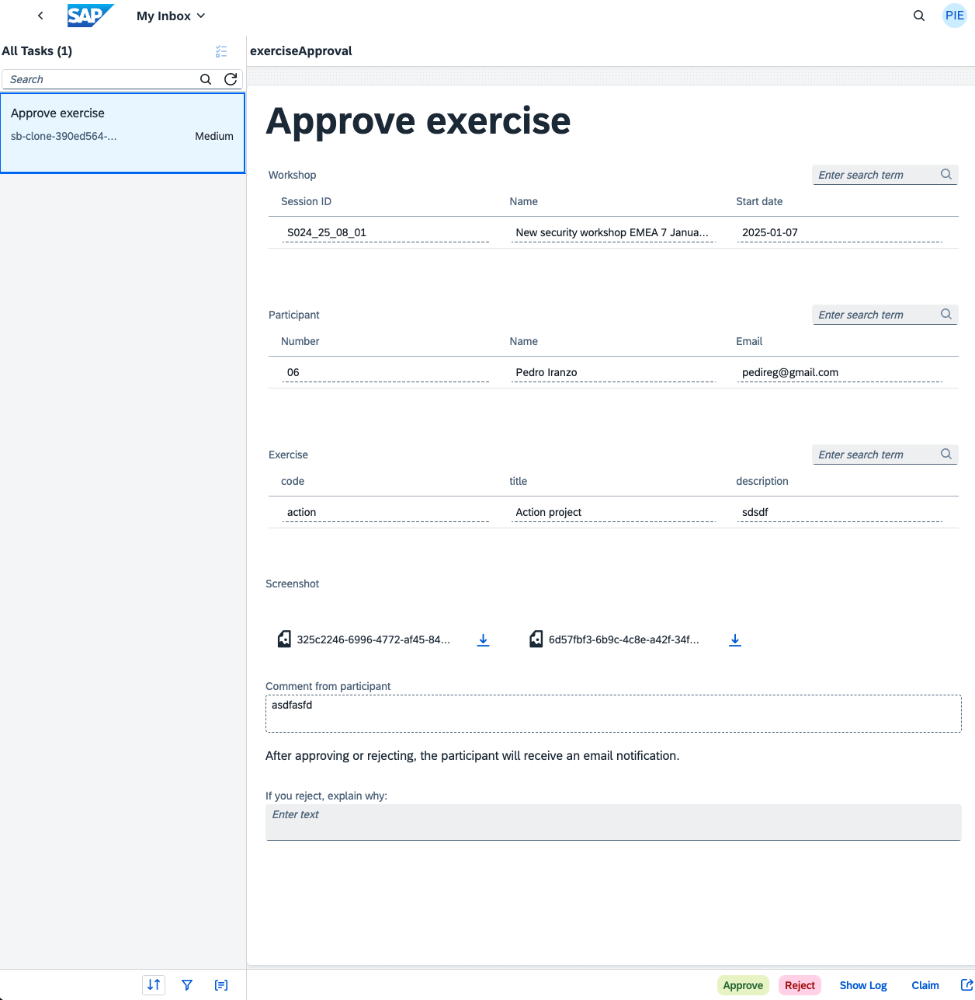
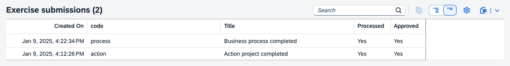
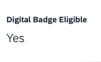

# Exercise forms and exercise approvals

If you are using a Docsify exercise page, you can define a list of exercises for your workshop, and allow participants to submit an image and a comment to prove the completion.

You will get these requests as tasks in your inbox, from which you will be able to approve or reject.

If a participant completes all mandatory exercises, the value "Eligible for digital badge" will turn to `Yes`.

### Procedure

1. In the workshop event page, define a list of exercises. Each must have:

    - Number: not really used right now
    - Code: used to identify the exercise when adding the form in the exercise page 
    - Name: Visible to participant. Exercise title
    - Description: Optional
    - Mandatory: Yes/No

    

2. See how to [add the submission form](pages/10-dynamic-content/README.md#exercise-forms) in the exercise page

3. Approve or reject the tasks

    
    
4. In the participant page: verify submissions and digital badge status

    

    
    