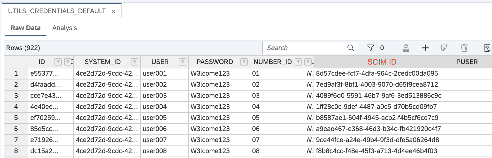

# System and credentials

## Architecture

_workshop-tools_ can assign each workshop one or more systems. A system is a set of users in a specific solution:

- Users user001 to user060 from techrig IAS are one system
- Users rmiller01 to rmiller50 from IAC IAS are another system
- 60 API keys from Datasphere are another system
- Users dsuser01 to dsuser60 from ajsk93daf IAS are another system
- ...

_workshop-tools_ also has another table with credentials for each system (called _default_ credentials). Each row there contains: the system it belongs to, the username, the password (Welcome1!, W3lcome123,...), the number and the SCIM ID of the user (if it's an IAS user).

> [!NOTE]
> Creating new systems and credentials can only be done by admins.

When assigning systems to a workshop, **one and only one must be marked as the main system**.

## Operation

When you _Activate_ a workshop, _workshop-tools_ will fetch all needed credentials from the default credentials table and load them into another table, the active _Credentials_ table. It is from that table where info is sent to the participants, and this data is what you can see in the workshop page.

> [!NOTE]
> Some systems have no default credentials defined, like the API keys of Datasphere or the Remote Desktop. These credentials have to be uploaded for each workshop to the active credentials table.

When sending the email with the credentials, the credentials from the main system are the ones sent in the email.

When you _Close_ the workshop, the credentials in the active _Credentials_ table are deleted.