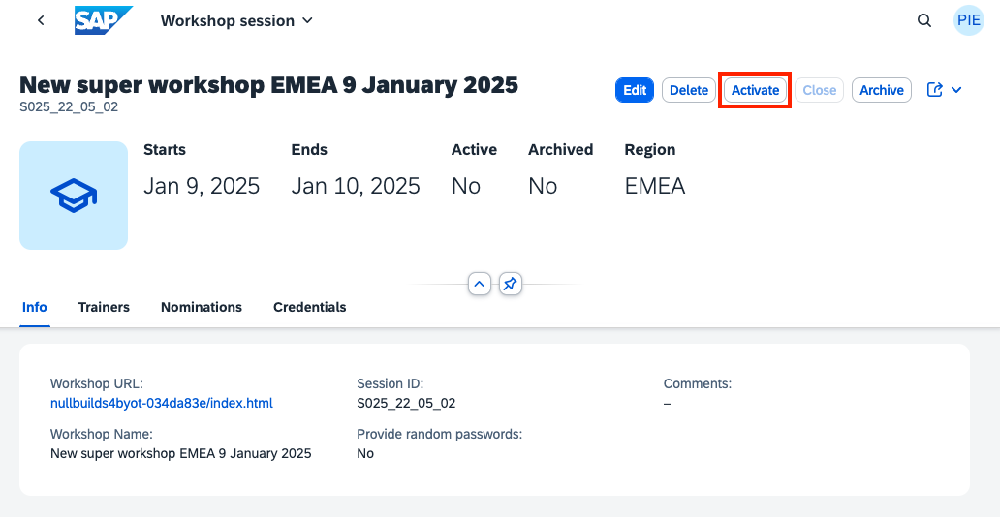
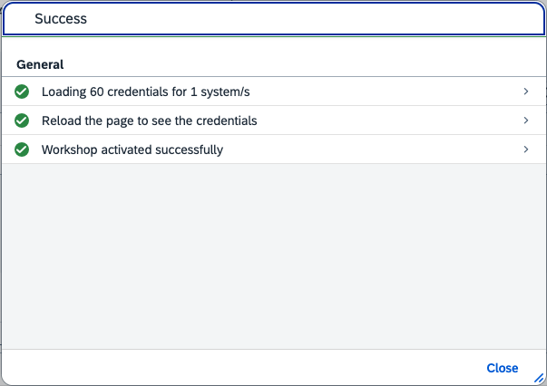

# Activating a workshop

Before you can send any credentials, you need to activate the workshop. Activating the workshop does the following:

- Verifies that no other workshop is using the same credentials
- [Loads the credentials](pages/16-credentials-systems/README.md) (and sets random passwords if needed)
- Let the rest of the team know that this workshop is being delivered

To activate a workshop, navigate to the workshop session and click the button:

You will get a result message:

> [!TIP|icon:fa-solid fa-check|label:Congratulations]
> The workshop is now active, you can send credentials, mark attendance and approve exercises