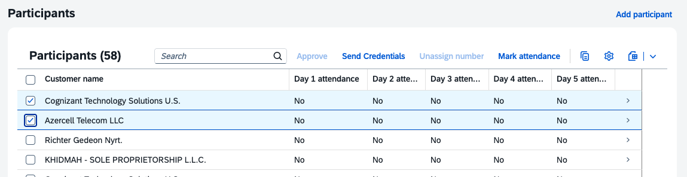
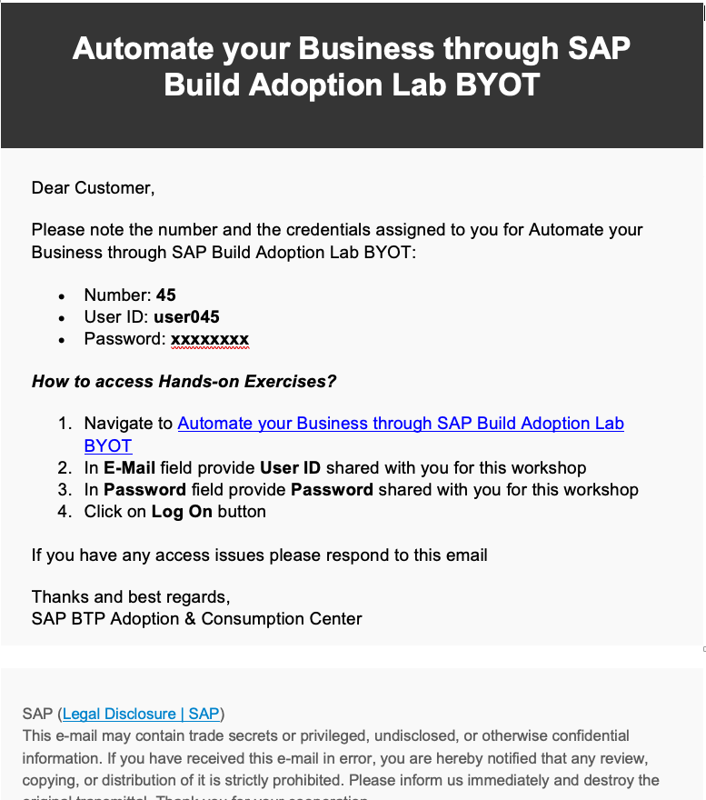
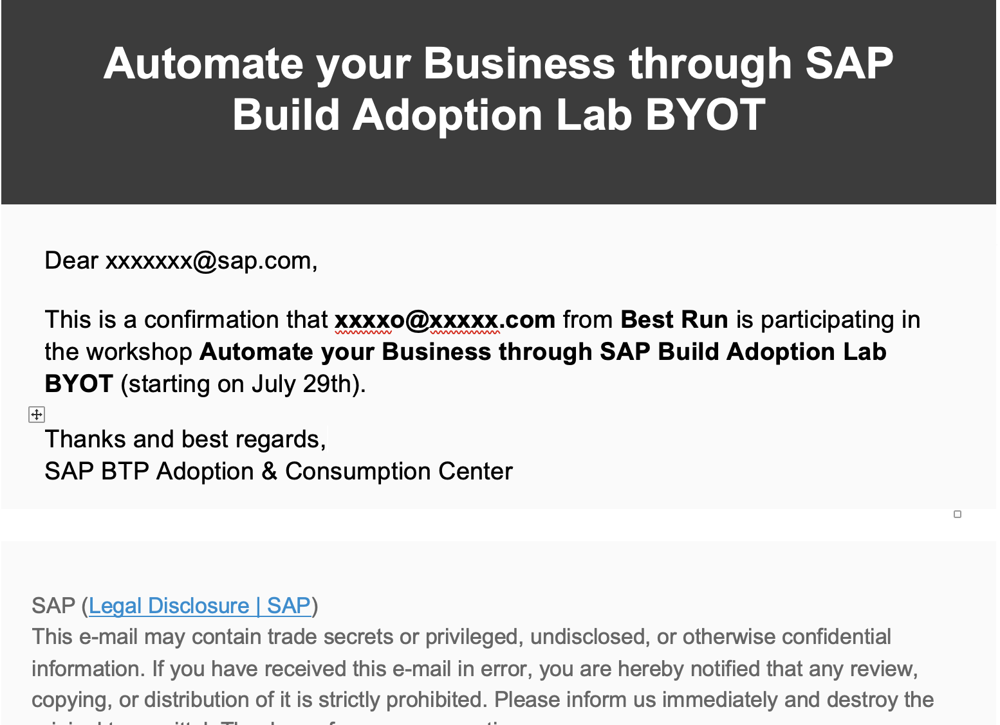

# Sending credentials

With one click, you can send the link to the exercises together with a user and password to the participant. Just make sure the participant is approved. Select it and press _Send credentials_.

An email will be sent to the participant with the format:

An email will be sent to the CSP (if populated) with the format:

