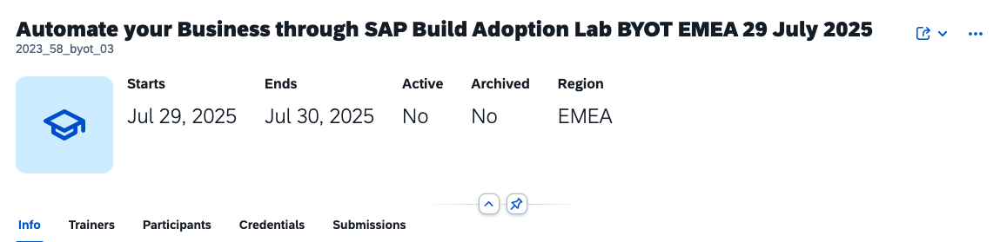

# Marking attendance

You can keep track of who joined the sessions. Each participant has 5 fields to track attendance:

Select the participants and click on _Mark attendance_.

The dates are calculated based on the start and end date of the workshop:

