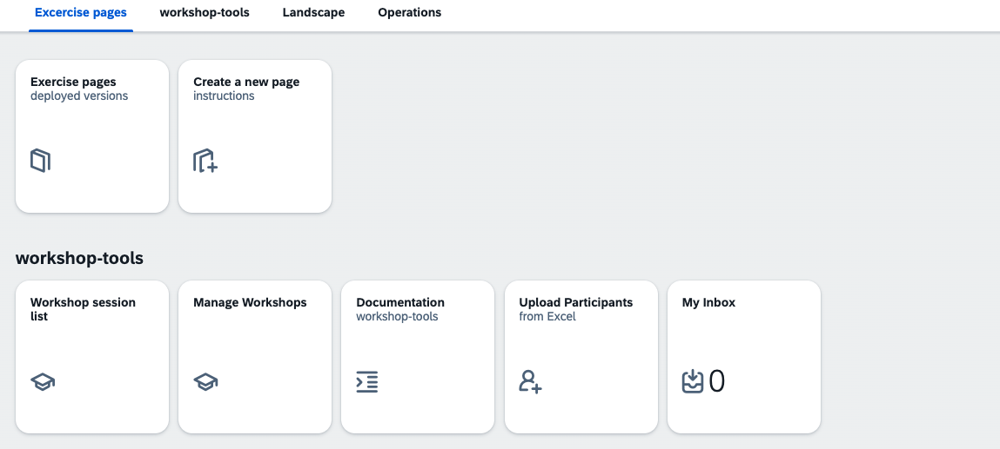
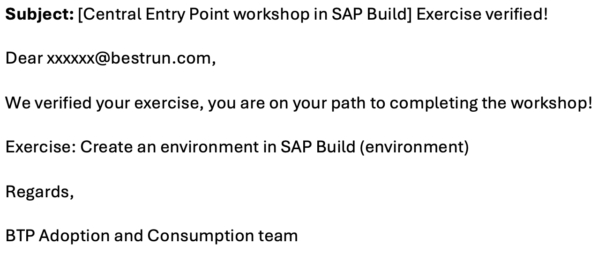

# Approving exercises

As participants submit their exercises, you will get tasks in the inbox of workshop-tools:

You can see the following details:
- Workshop
- Participant name and number
- Exercise submitted
- Link to download the screenshot

Approve or reject with a comment, and the customer will receive an email:

(Rejection email contains comment)